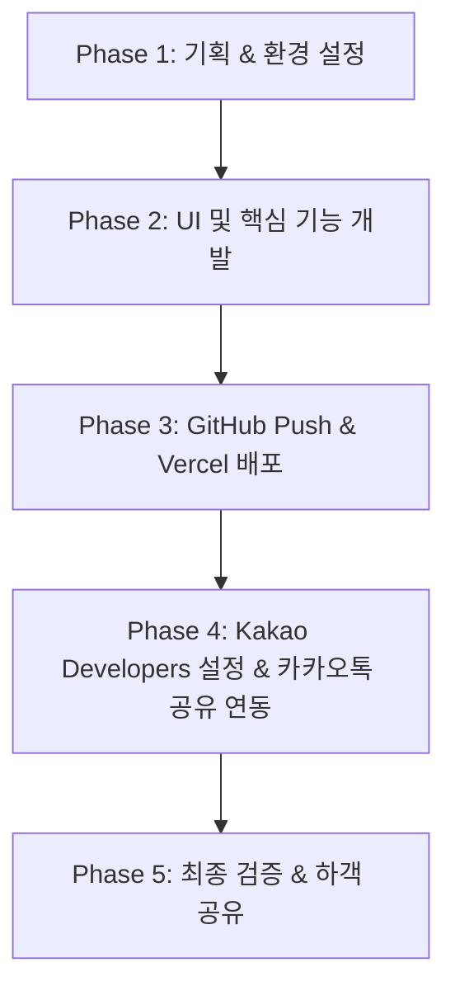

# 💍 모바일 청첩장 개발 기획서 (Wedding Invitation Project Plan)

## 1. 프로젝트 개요 (Overview)
* **프로젝트명**: 모바일 청첩장 웹 애플리케이션
* **목표**:
  * 모바일 디바이스에 최적화된 고급스럽고 세련된 디자인의 디지털 청첩장 제작
  * GitHub 저장소와 Vercel을 연동하여 빠르고 안정적인 무료 호스팅 서비스 구축
  * 카카오톡 링크 공유 시 "모바일 청첩장 보기" 버튼과 썸네일이 포함된 전용 리치 카드로 전달 기능 구현

---

## 2. 주요 기능 명세 (Key Features)

### 2.1 메인 화면 및 인터랙션 (Cover & Visuals)
* **메인 커버**: 신랑/신부 이름, 예식 일시 및 장소, 메인 화보 이미지
* **D-Day 카운트다운**: 예식 일시까지 남은 일/시간/분/초 실시간 표시

### 2.2 초대의 글 (Greeting)
* 신랑·신부의 마음을 전하는 인사말 및 시/문구
* 양가 부모님 성함 및 신랑·신부와의 관계 표시 (전화하기/문자하기 버튼 포함)

### 2.3 웨딩 갤러리 (Gallery)
* 그리드 형태의 웨딩 화보 앨범
* 클릭 시 확대하여 볼 수 있는 Full-screen 라이트박스 뷰어 및 스와이프 기능

### 2.4 오시는 길 & 지도 (Location & Navigation)
* **지도 연동**: 카카오 지도 API 연동으로 정확한 위치 및 대중교통 정보 제공
* **내비게이션 앱 연동**:
  * 카카오내비, T map, 네이버지도 연결 버튼 (클릭 시 해당 앱 자동 실행)
* **주차 및 대중교통 안내**: 지하철, 버스, 주차장 상세 안내 문구

### 2.5 마음 전하실 곳 (Account / Gift)
* **계좌번호 안내**: 신랑측 / 신부측 계좌번호 접기/펼치기 아코디언 메뉴
* **계좌 복사 기능**: 클릭 한 번으로 계좌번호가 클립보드에 복사되는 편리한 UX
* **카카오페이 연동**: 카카오페이 송금 링크 바로가기 지원

### 2.6 방명록 (Guestbook)
* **축하 메시지 (방명록)**: 하객들이 남기는 축하 방명록 게시판

### 2.7 카카오톡 공유 기능 (KakaoTalk Link Sharing)
* **Open Graph (OG) 메타태그 설정**:
  * 카카오톡, 문자메시지, SNS 링크 공유 시 대표 썸네일 이미지, 제목, 설명글 노출
* **카카오 디벨로퍼 JS SDK 연동**:
  * 단순 URL 공유가 아닌, 하단에 **"모바일 청첩장 보기"** 커스텀 액션 버튼이 적용된 카카오톡 메시지 카드 전달 기능 구현

---

## 3. 기술 스택 (Tech Stack)

| 구분 | 기술 / 도구 | 선정 이유 |
| :--- | :--- | :--- |
| **Framework** | **Next.js (App Router)** / React | SSR/SSG 지원으로 카카오톡/SNS 공유 시 **Open Graph 메타태그 인식 완벽 지원** 및 빠른 로딩 속도 |
| **Language** | **TypeScript / JavaScript** | 코드의 안정성과 타입 안전성 확보 |
| **Styling** | **Vanilla CSS / CSS Modules** | 미니멀하고 고급스러운 모바일 UI 커스텀 스타일링 |
| **SDK & API** | **Kakao JS SDK**, Kakao Map API | 카카오톡 리치 메시지 공유 버튼 구현 및 지도 연동 |
| **Code Management** | **Git & GitHub** | 버전 관리 및 Vercel 자동 배포 연동 |
| **Hosting & CD** | **Vercel** | GitHub 저장소와 연동하여 커밋 시 자동 빌드 & 무료 SSL(HTTPS) 호스팅 |

---

## 4. 개발 및 배포 단계별 로드맵 (Roadmap)

### Phase 1: 프로젝트 환경 설정 (Setup)
1. Next.js 기반 프로젝트 생성 및 필요 라이브러리 설치
2. GitHub 저장소 생성 및 로컬 코드 연결
3. 공통 테마(컬러 팔레트, 폰트, 반응형 기준) 설정

### Phase 2: UI 컴포넌트 및 기능 개발 (Development)
1. Cover, Greeting, Gallery, Location, Account 컴포넌트 개발
2. 계좌 복사 기능 및 지도 API 연동
3. 반응형 모바일 레이아웃 및 이펙트(페이드인 애니메이션 등) 적용
4. Open Graph 태그(`og:title`, `og:description`, `og:image`, `og:url`) 기본 구성

### Phase 3: GitHub & Vercel 배포 (Deployment)
1. GitHub 메인 브랜치에 코드 Push
2. Vercel 프로젝트 생성 후 GitHub 저장소 연결
3. 배포 완료 후 제공되는 실서버 URL(예: `https://wedding-invitation-xxx.vercel.app`) 확보 및 정상 작동 확인

### Phase 4: 카카오 디벨로퍼 설정 및 공유 연동 (Kakao Integration)
> 💡 *Vercel 배포 완료 후 진행할 단계입니다.*

1. **Kakao Developers 가입 및 애플리케이션 등록**
2. **웹 플랫폼 도메인 등록**: Vercel에서 발급받은 실제 배포 URL 등록
3. **JavaScript 키 발급 및 프로젝트 적용**
4. **Kakao.Share API 연동**: "모바일 청첩장 보기" 버튼이 포함된 메시지 템플릿 구현

### Phase 5: 최종 검증 및 오픈 (Testing & Release)
1. 다양한 모바일 기기(iOS, Android)에서 레이아웃 및 폰트 검증
2. 카카오톡 공유 메시지 카드 테스트 (이미지, 문구, "모바일 청첩장 보기" 버튼 클릭 시 이동 여부 확인)
3. 예식장 지도 및 길찾기 링크 정상 작동 확인

---

## 5. 추후 진행할 카카오 디벨로퍼 가이드 개요 (미리보기)

Vercel 배포 완료 후 아래의 상세 절차를 차근차근 안내해 드릴 예정입니다:

1. **Kakao Developers 접속**: [https://developers.kakao.com](https://developers.kakao.com) 로그인
2. **내 애플리케이션 추가**: 앱 이름(예: `모바일청첩장`) 및 사업자명 입력 후 생성
3. **앱 키(App Key) 확인**: `JavaScript 키` 복사
4. **플랫폼 설정**: `[내 애플리케이션] > [앱 설정] > [플랫폼]` 메뉴에서 `Web` 플랫폼 추가 후 Vercel 도메인 URL 입력
5. **코드 내 SDK 초기화 및 공유 기능 호출**: 발급받은 JavaScript 키를 사용하여 카카오톡 공유 기능 완성

---

## 6. 완료 조건 (Definition of Done)
- [O] Vercel을 통한 HTTPS 보안 프로토콜 기반 웹 사이트 접근 가능
- [O] 모바일 화면에 최적화된 반응형 UI 및 인터랙션 작동
- [ ] 카카오톡으로 링크 전송 시 "모바일 청첩장 보기" 버튼이 있는 카드 메시지 정상 전달
- [ ] 지도 앱 실행 및 계좌 복사 기능 정상 작동
